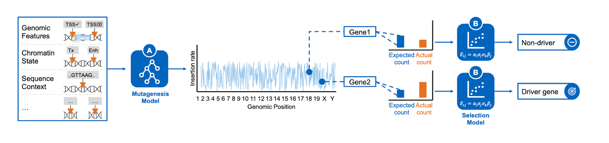

## TransMiCron: Accurate prediction of insertion probabilities improves detection of cancer driver genes from transposon mutagenesis screens

## Background: Transmicron
Transmicron is an easy to run pipeline to identify common insertion sites (CIS) from transposon mutagenesis screens. It comprises two steps: A) The mutagenesis model to correct for transposon integration biases, and B) the selection model to identify CIS. In the following, we provide a guide on how to run Transmicron. Details on the method can be found in the manuscript [link]. 



### Installation & Input Data
1. Make sure anaconda is installed on your system (https://docs.anaconda.com/anaconda/install/).
2. Clone or download the repository, then open a terminal and navigate to the Transmicron folder.
```
git clone https://github.com/gagneurlab/transmicron.git
cd transmicron
```
3. Create and activate the [Conda environment](environment.yml) using the following commands.

```
conda env create --name transmicron --file=environment.yml
conda activate transmicron
```
Setting up the conda environment will take around 40 minutes.

### Prepare insertion data
YOU CAN SKIP THIS STEP IF YOU RUN TRANSMICRON ON THE TEST DATA PROVIDED BY US.

4. Please prepare a [BED](https://www.genomatix.de/online_help/help_regionminer/bedformat_help.html) file specifying the genomic locations of your transposon insertions. 5 columns are mandatory:
* Column 1 specifies the chromosome (Format: chr1, chr2...chrX, chrY).
* Column 2 specifies the position [START] of the insertion site (a number).
* Column 3 specifies the END of the insertion site (a number). Always: END = START + 1  (e.g. START: 1234, END: 1235).
* Column 4 specifies the orientation of transposon insertions ("-" or "+").
* Column 5 supplies Sample / Tumor identifiers.

Column headers for columns 4 and 5 should be "orientation" and "TumorID" (other column names do not matter). Additional columns will be disregarded. An example can be found under Input/TestInsertionBed/. 

### Executing the code
5. Run the whole Transmicron pipeline using [Snakemake](https://snakemake.readthedocs.io/en/stable/)  by the following commands:
```
python run.py --snakemakeRule="-n" #dry run
python run.py --insertionFile="Input/BEDInsertionTesting/DLBCLPB.BED" --transposonSystem="PB" --snakemakeRule="--cores 4"
```
You can define several parameters to these commands, depending on how you want to run Transmicron. All the parameters are listed in the next section with their default value. The program sets the default value to any parameter that is not defined by the user.
<details>
    <summary>Running with full Parameters and Default Values (Click to Expand)</summary>

```
python run.py \
		--insertionFile="Input/BEDInsertionTesting/DLBCLPB.BED"  \
		--transposonSystem="PB" \
		--mutagenesisMethod="predefinedFeatures" \
		--customFeatures="Input/FeatureBeds/DNASEmesc_SRX1452763.05.bed,Input/FeatureBeds/DNASEmesc_SRX1452763.05.bed" \
		--annotation="genes" \
		--multestCorrection="bonferroni" \
		--snakemakeRule="--cores 4" \
		--outputDir="Output" \
		--downloadDir="PrecomputedData" \
		--usePrecomputedFeatures="true" \
				
```

All paths can be given relative to the root of the program (i.e. where the snakefile is) or as absolute paths. If you want to use default parameters and data, you do not need to specify any additional parameters:
* insertionFile: Please supply the filepath to the BED file containing the locations of your insertions. The paths should be comma separated and the final results will be saved to [outputDir/datset] for each BED file provided here, e.g. Output/DLBCLPBD. Do not specify if you want to run Transmicron on the testing dataset.
* transposonSystem:  Transposon systems of given datasets, the same order as insertion BED files. Options: 1. PB [PiggyBac, default] 2. SB [Sleeping Beauty]
* mutagenesisMethod: Which version of the mutagenesis model do you want to apply? Options:
  * 1. "predefinedFeatures": default option; the mutagenesis model is retrained on your data using our predefined features.
  * 2. "pretrainedModel": a pretrained version of the mutagenesis model on mESC insertions is used (not available yet)
  * 3. "null": no mutagenesis model is applied, Transmicron controls only for the distribution of TA / TTAA nucleotides.
  * 4. customFeatures: please supply one or more filepaths to BED files containing feature information. The mutagenesis model is retrained using the distance of insertions to these features as input.
* annotation: Please Specify the target annotation used to identify CIS. Options: 1. "genes" [default] 2. "10kb", "20kb"...[any binlength] 3. filepath [specify a filepath to a BED file file custom features of interest, e.g. regulatory elementes]
* snakemakeRule: Specify snakemake rule here
* outputDir: Path to where the results of analysis will be written to. 
* downloadDir: Path to where pre-computed features will be downloaded to if needed. Data will be downloaded from projects [zenodo page](https://zenodo.org/record/7352017).
* usePrecomputedFeatures: Set this to true if you want to use our pre-computed features. The features will be downloaded with your first run. The data is around 15GB and downloading may take around 30 mins depending on your internet speed.


 
</details>


It is also possible to also invoke single workflows explicitly e.g. for defineMutagenesisFeatures with:
```
python run.py --snakemakeRule="-n" #dry run
python run.py --snakemakeRule="--until defineMutagenesisFeatures --cores 4" # run with 8 cores
```

The code is written in R and python and tested on python 3.9 and a Linux OS but should run on any OS. 


## Features and Annotations
By default the following datasets are used:

Insertion Sites: 
* Input/TestInsertionBed/DLBCLPB.BED
Input features for the mutagenesis model:
* Input/FeatureBeds/ATACmesc_SRX2514792.bed
* Input/FeatureBeds/DNASEmesc_SRX1452763.05.bed

Gene annotation:
* Input/Annotations/genes/mm10.refGene.gtf.gz 

All files are provided in Input folder.
Other input BED files used in our analysis can be found in projects [zenodo page](https://zenodo.org/record/7352017).

## Citation
If you use Transmicron in your research, please cite our [manuscript](https://academic.oup.com/nar/advance-article/doi/10.1093/nar/gkac1215/6976062).
```
@article{10.1093/nar/gkac1215,
    author = {Bredthauer, Carl and Fischer, Anja and Ahari, Ata Jadid and Cao, Xueqi and Weber, Julia and Rad, Lena and Rad, Roland and Wachutka, Leonhard and Gagneur, Julien},
    title = "{Transmicron: accurate prediction of insertion probabilities improves detection of cancer driver genes from transposon mutagenesis screens}",
    journal = {Nucleic Acids Research},
    year = {2023},
    doi = {10.1093/nar/gkac1215},
    url = {https://doi.org/10.1093/nar/gkac1215},
}
```
## Acknowledgements and Funding
This work was supported by the German Bundesministerium für Bildung und Forschung (BMBF) supported the study through the VALE (Entdeckung und Vorhersage der Wirkung von genetischen Varianten durch Artifizielle Intelligenz für LEukämie Diagnose und Subtyp-Identifizierung) project (031L0203B to CB, XQ and JG)
